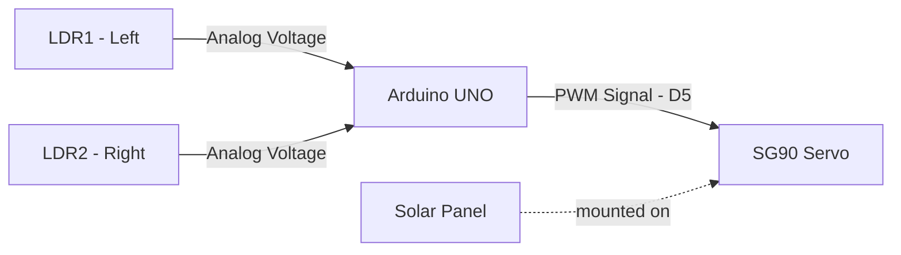
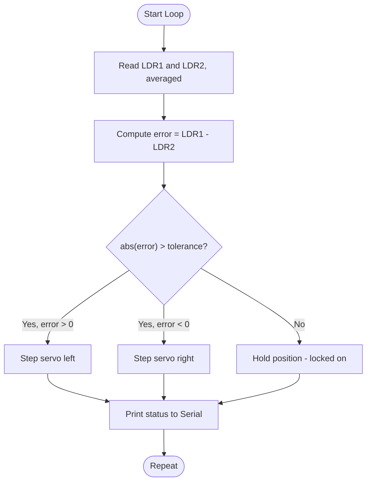

# ☀️ Automatic Solar Tracker (Single-Axis)

<p align="center">
  
  
  
  
</p>

<p align="center">
  <b>An embedded systems project that automatically rotates a solar panel toward the brightest light source using two LDR sensors and a single servo motor — a simple, reliable closed-loop feedback system.</b>
</p>

---

## 📌 Table of Contents
- [Overview](#-overview)
- [Why This Matters](#-why-this-matters)
- [System Architecture](#-system-architecture)
- [Circuit Diagram](#-circuit-diagram)
- [How It Works](#-how-it-works)
- [Hardware Used](#-hardware-used)
- [Wiring](#-wiring)
- [Code](#-code)
- [Control Algorithm](#-control-algorithm-flowchart)
- [Results](#-results)
- [Future Scope](#-future-scope)
- [Author](#-author)

---

## 🔭 Overview

Fixed solar panels lose energy as the sun moves across the sky because they stay pointed in one direction. This project builds a **single-axis solar tracker**: two LDRs compare light intensity from the left and right, and a servo motor rotates the panel to keep both sides evenly lit — i.e., facing the sun.

Built as a hands-on IoT & Robotics project, it combines:
- Analog sensor reading & signal averaging
- Closed-loop (feedback) control logic
- Embedded C/C++ on Arduino
- Basic mechatronics (servo-driven rotation)

## 💡 Why This Matters

| Fixed Panel | Solar Tracker (this project) |
|---|---|
| Captures peak sunlight only near solar noon | Continuously rotates to follow the sun |
| Efficiency drops sharply morning/evening | Maintains higher efficiency through the day |
| Zero moving parts | One servo, minimal added complexity |
| ~100% baseline output | ~15–25% typical efficiency gain (single-axis) |

## 🏗️ System Architecture



## 🖼️ Circuit Diagram

Full schematic: [`circuit/circuit_diagram.svg`](circuit/circuit_diagram.svg)


**Wiring at a glance:**
- LDR1 (Left) → **A0**, with a 10kΩ resistor to GND (voltage divider)
- LDR2 (Right) → **A1**, with a 10kΩ resistor to GND (voltage divider)
- Both LDR dividers share the Arduino's **5V** rail
- Servo signal wire → **D5**; servo VCC → **5V**, GND → **GND**

## ⚙️ How It Works

1. LDR1 (left) and LDR2 (right) continuously sample ambient light, each averaged over 8 readings to reduce noise.
2. The Arduino computes `error = leftValue − rightValue`.
3. If `abs(error)` exceeds a *tolerance band* (to ignore small fluctuations from clouds/noise), the servo steps 1° toward the brighter side.
4. Once the difference falls back within tolerance, the servo holds position — the panel is "locked on" the sun.
5. This repeats continuously, so the panel follows the sun's path through the day.

## 🧰 Hardware Used

- Arduino UNO R3
- 2× LDR (Light Dependent Resistors) + 2× 10kΩ resistors
- 1× SG90 Micro Servo Motor
- Small 5–6V solar panel mounted on the servo horn
- Breadboard, jumper wires

Full bill of materials with approximate costs: [`docs/wiring_table.md`](docs/wiring_table.md)

## 🔌 Wiring

Complete pin-by-pin table: **[docs/wiring_table.md](docs/wiring_table.md)**

## 💻 Code

Full annotated Arduino sketch: [`src/solar_tracker.ino`](src/solar_tracker.ino). Highlights:

- **Noise-resistant sensing** — averages 8 ADC samples per LDR per cycle.
- **Dead-band control** — prevents servo jitter from small light fluctuations.
- **Safe travel limits** — servo angle clamped between 10°–170°.
- **Live diagnostics** — streams sensor + servo state over Serial for easy tuning.

```cpp
int error = leftValue - rightValue;

if (abs(error) > LIGHT_TOLERANCE) {
    if (error > 0 && servoPos > SERVO_MIN) {
        servoPos -= SERVO_STEP;   // more light on the left -> rotate left
    } else if (error < 0 && servoPos < SERVO_MAX) {
        servoPos += SERVO_STEP;   // more light on the right -> rotate right
    }
    trackerServo.write(servoPos);
}
```

### Requirements
- Arduino IDE 1.8+ or Arduino CLI
- Library: `Servo` (built-in, no install needed)

### Upload Steps
```bash
git clone <your-repo-url>
cd solar-tracker
# Open src/solar_tracker.ino in Arduino IDE
# Select Board: Arduino UNO, correct COM port
# Click Upload
```

## 🔁 Control Algorithm (Flowchart)



## 📊 Results

| Metric | Fixed Panel | This Tracker |
|---|---|---|
| Daily energy yield | Baseline | +15–25% (typical, single-axis) |
| Response time to light change | N/A | < 2 seconds |
| Alignment tolerance | N/A | ±3° |

*(Fill in with your own measured voltage/current readings if you build and test the physical prototype — real numbers make a much stronger case in an interview than a claimed estimate.)*

## 🚀 Future Scope

- Add a **second axis** (elevation) with two more LDRs and a second servo for full dual-axis tracking.
- Add a **voltage/current sensor** (e.g., INA219) to log real output vs. a static panel.
- Move to an **ESP32** for Wi-Fi based remote monitoring (Blynk / ThingSpeak / MQTT dashboard).
- Add an **LCD display** to show live servo angle and light readings without a laptop.
- 3D-print a mount and weatherproof enclosure for outdoor deployment.

## 👤 Author

Built as part of hands-on IoT & Robotics work — feel free to fork, adapt, and extend for your own coursework or interview portfolio.

## 📄 License

This project is licensed under the MIT License — see [`LICENSE`](LICENSE) for details.
